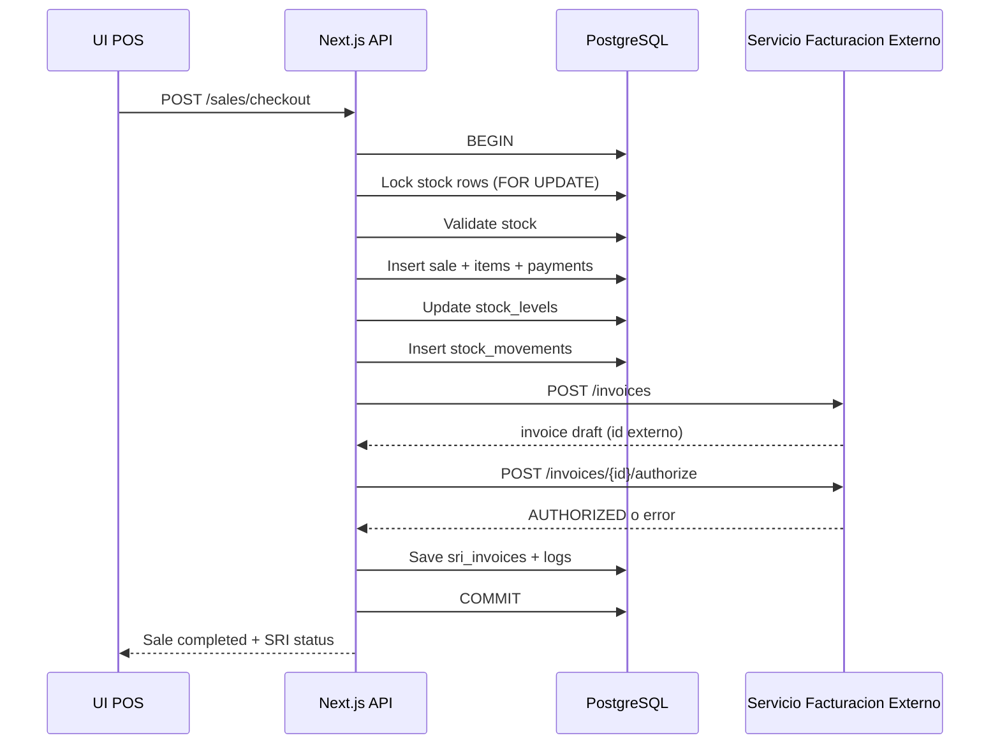

# MVP Inventario + Ventas + Facturacion SRI

## 1. Objetivo
Construir un MVP monolitico para:

1. Gestionar inventario (stock actual y movimientos).
2. Registrar ventas (cabecera, items y pago).
3. Ejecutar en el mismo flujo la facturacion electronica SRI:
   - Crear factura en el servicio externo.
   - Intentar autorizar inmediatamente.
4. Operar un modulo posterior para:
   - Reintentos de autorizacion SRI.
   - Reimpresion/descarga de XML y RIDE.

## 2. Alcance MVP

### Incluido
1. CRUD de productos y clientes.
2. Stock por producto y kardex de movimientos.
3. Checkout de venta con descuento automatico de stock.
4. Integracion con API externa SRI (create + authorize).
5. Persistencia local de trazabilidad de facturas y errores.
6. Endpoints para reintentar autorizacion y recuperar documentos.
7. Despliegue en Cloud Run o VPS via Docker.

### No incluido (fase 2)
1. Multi-sucursal.
2. Compras y cuentas por pagar.
3. Devoluciones complejas con NC.
4. Motor de promociones avanzado.
5. BI/reporteria avanzada.

## 3. Decisiones de arquitectura

## 3.1 Stack
1. Framework: Next.js 15+ (App Router) con TypeScript.
2. Backend: API Routes/Route Handlers en el mismo proyecto.
3. ORM: Prisma.
4. DB: PostgreSQL.
5. Validacion: Zod.
6. Auth MVP: JWT con roles basicos.
7. Infra: Docker + Cloud Run (recomendado) o VPS.

## 3.2 Por que monolito Next.js
1. Un solo repositorio y un solo despliegue.
2. Menor costo operativo para MVP.
3. Reduce friccion entre frontend y backend.
4. Facil migracion futura a microservicios si crece carga.

## 3.3 Componentes logicos
1. Modulo Catalogos: productos y clientes.
2. Modulo Inventario: stock y movimientos.
3. Modulo Ventas: checkout transaccional.
4. Modulo Facturacion SRI: integracion externa y operaciones.
5. Modulo Reportes basicos.
6. Modulo Seguridad/Auditoria.

## 4. Flujo end-to-end (single flow)

## 4.1 Flujo de checkout (obligatorio)
Todo desde un endpoint: `POST /api/v1/sales/checkout`

1. Recibe payload de venta: cabecera + items + pagos + datos cliente.
2. Inicia transaccion SQL.
3. Bloquea filas de stock de productos involucrados (`FOR UPDATE`).
4. Valida disponibilidad de stock.
5. Crea `sales` + `sale_items` + `sale_payments`.
6. Descuenta `stock_levels` y crea `stock_movements (OUT)`.
7. Genera y persiste request SRI para trazabilidad.
8. Llama servicio externo: `POST /api/v1/invoices` (create).
9. Si create OK, llama `POST /api/v1/invoices/{id}/authorize`.
10. Persiste respuesta final en `sri_invoices`.
11. Confirma transaccion.
12. Devuelve venta + estado SRI:
    - `AUTHORIZED` si se autorizo.
    - `PENDING_SRI` si venta ok pero autorizacion fallo.

Nota: en el MVP la venta se confirma aunque falle SRI, para no bloquear caja. La factura queda en cola de reintento.

## 4.2 Diagrama de secuencia


## 5. Modelo de datos (PostgreSQL)

## 5.1 Convenciones
1. IDs `uuid`.
2. Fechas en UTC (`timestamptz`).
3. Montos `numeric(12,2)`.
4. Cantidades de stock `numeric(14,3)`.
5. Estados con `varchar` + checks o enums.

## 5.2 Tablas

### users
1. `id uuid pk`
2. `name varchar(120)`
3. `email varchar(160) unique`
4. `password_hash text`
5. `role varchar(20)` (`ADMIN`, `SELLER`)
6. `created_at`, `updated_at`

### customers
1. `id uuid pk`
2. `tipo_identificacion varchar(2)` (ej. `04`)
3. `identificacion varchar(20)`
4. `razon_social varchar(200)`
5. `direccion varchar(250)`
6. `email varchar(160)`
7. `telefono varchar(20)`
8. `created_at`, `updated_at`
9. `unique (tipo_identificacion, identificacion)`

### products (con secuencial requerido)
1. `id uuid pk`
2. `secuencial bigint unique not null default nextval('products_secuencial_seq')`
3. `sku varchar(40) unique null`
4. `nombre varchar(180)`
5. `descripcion text`
6. `precio numeric(12,2)`
7. `tarifa_iva numeric(5,2)` (ej. 0, 15)
8. `activo boolean default true`
9. `created_at`, `updated_at`

Codigo visible sugerido:
`codigo_producto = 'PROD-' || lpad(secuencial::text, 6, '0')`

### stock_levels
1. `id uuid pk`
2. `product_id uuid fk products(id)`
3. `quantity numeric(14,3) not null default 0`
4. `min_quantity numeric(14,3) not null default 0`
5. `updated_at`
6. `unique(product_id)`

### stock_movements
1. `id uuid pk`
2. `product_id uuid fk products(id)`
3. `movement_type varchar(20)` (`IN`, `OUT`, `ADJUSTMENT`)
4. `quantity numeric(14,3) not null`
5. `reference_type varchar(20)` (`SALE`, `MANUAL`, `PURCHASE`)
6. `reference_id uuid null`
7. `notes text null`
8. `created_by uuid fk users(id)`
9. `created_at`

### sales
1. `id uuid pk`
2. `sale_number bigint unique not null` (secuencia interna de venta)
3. `customer_id uuid fk customers(id)`
4. `subtotal numeric(12,2)`
5. `discount_total numeric(12,2)`
6. `tax_total numeric(12,2)`
7. `total numeric(12,2)`
8. `status varchar(20)` (`COMPLETED`, `CANCELLED`)
9. `created_by uuid fk users(id)`
10. `created_at`, `updated_at`

### sale_items
1. `id uuid pk`
2. `sale_id uuid fk sales(id)`
3. `product_id uuid fk products(id)`
4. `cantidad numeric(14,3)`
5. `precio_unitario numeric(12,2)`
6. `descuento numeric(12,2)`
7. `tarifa_iva numeric(5,2)`
8. `subtotal numeric(12,2)`
9. `valor_iva numeric(12,2)`
10. `total numeric(12,2)`

### sale_payments
1. `id uuid pk`
2. `sale_id uuid fk sales(id)`
3. `forma_pago varchar(4)` (catalogo SRI, ej `01`)
4. `amount numeric(12,2)`
5. `plazo int default 0`
6. `unidad_tiempo varchar(20) default 'DIAS'`
7. `created_at`

### sri_invoices
1. `id uuid pk`
2. `sale_id uuid unique fk sales(id)`
3. `issuer_id uuid not null`
4. `external_invoice_id uuid null` (id en servicio externo)
5. `secuencial varchar(20) null`
6. `clave_acceso varchar(60) null`
7. `status varchar(30)` (`DRAFT`, `AUTHORIZED`, `PENDING_SRI`, `ERROR`)
8. `sri_reception_status varchar(40) null`
9. `sri_authorization_status varchar(40) null`
10. `authorization_number varchar(60) null`
11. `authorized_at timestamptz null`
12. `retry_count int not null default 0`
13. `last_error text null`
14. `create_request_payload jsonb not null`
15. `create_response_payload jsonb null`
16. `authorize_response_payload jsonb null`
17. `created_at`, `updated_at`

### sri_invoice_documents
1. `id uuid pk`
2. `sri_invoice_id uuid fk sri_invoices(id)`
3. `xml_signed_path text null`
4. `xml_authorized_path text null`
5. `ride_pdf_path text null`
6. `storage_provider varchar(20)` (`local`, `gcs`, `s3`)
7. `created_at`, `updated_at`
8. `unique(sri_invoice_id)`

### integration_logs
1. `id uuid pk`
2. `service varchar(40)` (`SRI_INVOICE`)
3. `operation varchar(30)` (`CREATE`, `AUTHORIZE`, `RETRY`)
4. `request_payload jsonb`
5. `response_payload jsonb`
6. `http_status int`
7. `success boolean`
8. `error_message text null`
9. `created_at`

## 6. Endpoints API MVP

## 6.1 Inventario
1. `GET /api/v1/products`
2. `POST /api/v1/products`
3. `PATCH /api/v1/products/{id}`
4. `GET /api/v1/stock`
5. `POST /api/v1/stock/adjustments`
6. `GET /api/v1/stock/movements`

## 6.2 Ventas + Facturacion unificada
1. `POST /api/v1/sales/checkout`

Payload base:
```json
{
  "issuerId": "uuid",
  "fechaEmision": "DD/MM/YYYY",
  "customer": {
    "tipoIdentificacion": "04",
    "identificacion": "0950595603001",
    "razonSocial": "GISMAR TOALA",
    "direccion": "Quito",
    "email": "cliente@correo.com",
    "telefono": "0999999999"
  },
  "items": [
    {
      "productId": "uuid",
      "cantidad": 1,
      "precioUnitario": 1.0,
      "descuento": 0.0,
      "tarifaIva": 15
    }
  ],
  "payments": [
    {
      "formaPago": "01",
      "total": 1.15,
      "plazo": 0,
      "unidadTiempo": "DIAS"
    }
  ],
  "infoAdicional": {}
}
```

Respuesta:
```json
{
  "success": true,
  "data": {
    "saleId": "uuid",
    "saleNumber": 13,
    "saleStatus": "COMPLETED",
    "invoice": {
      "sriInvoiceId": "uuid",
      "externalInvoiceId": "uuid",
      "status": "AUTHORIZED",
      "authorizationNumber": "string",
      "claveAcceso": "string"
    }
  }
}
```

Si SRI falla:
`invoice.status = "PENDING_SRI"` y `lastError` con motivo.

## 6.3 Operaciones SRI (post-venta)
1. `POST /api/v1/sri-invoices/{id}/retry`
2. `GET /api/v1/sri-invoices?status=PENDING_SRI`
3. `GET /api/v1/sri-invoices/{id}`
4. `GET /api/v1/sri-invoices/{id}/xml`
5. `GET /api/v1/sri-invoices/{id}/ride`

## 7. Mapeo con servicio externo SRI

## 7.1 Create invoice
1. Construir payload segun contrato actual del proveedor.
2. Enviar `issuerId`, cliente, totales, `detalles`, `pagos`.
3. Guardar respuesta completa en `create_response_payload`.

## 7.2 Authorize invoice
1. Llamar endpoint `/invoices/{externalId}/authorize`.
2. Si autoriza:
   - actualizar `status = AUTHORIZED`
   - guardar `clave_acceso`, `authorization_number`, `authorized_at`
3. Si falla:
   - `status = PENDING_SRI` o `ERROR` (si no recuperable)
   - incrementar `retry_count`
   - guardar `last_error`

## 7.3 Reintentos
1. Manual por endpoint de operacion.
2. Automatico recomendado por scheduler (cada hora) para pendientes.
3. Max intentos configurable (ej. 10).
4. Backoff exponencial simple.

## 8. Reglas de negocio criticas
1. No vender stock negativo.
2. Todo checkout usa transaccion de base de datos.
3. No duplicar checkout por doble click:
   - usar `idempotency_key` por request.
4. Si create SRI falla:
   - venta se mantiene `COMPLETED`
   - factura queda `PENDING_SRI`
5. Si authorize falla:
   - guardar error y permitir retry.
6. No borrar ventas ni movimientos (solo anulacion logica).

## 9. Seguridad y auditoria
1. JWT con expiracion corta.
2. Roles: `ADMIN`, `SELLER`.
3. Auditoria de operaciones sensibles:
   - ajustes de stock
   - anulaciones
   - reintentos SRI
4. No loguear datos sensibles en texto plano.
5. Rotacion de secretos por variables de entorno.

## 10. Observabilidad
1. Logs estructurados JSON.
2. Correlation ID por request.
3. Metricas:
   - tiempo checkout
   - tasa de autorizacion SRI
   - pendientes SRI
4. Alertas:
   - cola `PENDING_SRI` mayor a umbral
   - errores consecutivos SRI.

## 11. Despliegue

## 11.1 Cloud Run (recomendado)
1. Build container Docker.
2. Deploy servicio Next.js.
3. DB en Cloud SQL PostgreSQL.
4. Cloud Scheduler para `retry` automatico.
5. Bucket GCS para XML/RIDE.

Ventajas:
1. Escalado automatico.
2. Menos operacion de servidores.
3. SSL y networking manejado.

## 11.2 VPS
1. Docker Compose (app + postgres + reverse proxy).
2. Nginx + TLS.
3. Backup diario de DB.
4. Cron para retries.

Riesgo principal VPS: mayor carga operativa y hardening manual.

## 11.3 Variables de entorno
1. `DATABASE_URL`
2. `NEXTAUTH_SECRET` o `JWT_SECRET`
3. `SRI_BASE_URL`
4. `SRI_TIMEOUT_MS`
5. `SRI_RETRY_MAX`
6. `STORAGE_PROVIDER`
7. `GCS_BUCKET` (si aplica)
8. `APP_TZ=America/Guayaquil`

## 12. Estructura sugerida del proyecto
```text
src/
  app/
    api/
      v1/
        sales/checkout/route.ts
        sri-invoices/[id]/retry/route.ts
        sri-invoices/[id]/xml/route.ts
        sri-invoices/[id]/ride/route.ts
        products/route.ts
        stock/route.ts
  modules/
    sales/
      checkout.service.ts
      sales.repository.ts
      dto.ts
    inventory/
      inventory.service.ts
    sri/
      sri.client.ts
      sri.mapper.ts
      sri.service.ts
      sri.retry.service.ts
    shared/
      db.ts
      errors.ts
      idempotency.ts
      logger.ts
prisma/
  schema.prisma
  migrations/
docs/
  mvp-inventario-ventas-sri.md
```

## 13. Plan de implementacion (4 semanas)

## Semana 1
1. Shadcn Next.js + Prisma + Postgres.
2. Migraciones iniciales.
3. CRUD productos/clientes.
4. Secuencial de productos.

## Semana 2
1. Modulo inventario:
   - stock actual
   - ajustes
   - movimientos
2. Validaciones y pruebas unitarias.

## Semana 3
1. Checkout transaccional completo.
2. Integracion create + authorize con servicio SRI.
3. Persistencia de trazas y estados.

## Semana 4
1. Reintentos y reimpresion XML/RIDE.
2. Hardening de errores y timeouts.
3. Pruebas E2E.
4. Docker y despliegue Cloud Run/VPS.

## 14. Casos de prueba minimos
1. Venta exitosa con autorizacion inmediata.
2. Venta exitosa con fallo de autorizacion (queda pendiente).
3. Reintento manual pasa de `PENDING_SRI` a `AUTHORIZED`.
4. Sin stock suficiente (rechazo antes de facturar).
5. Concurrencia: dos ventas simultaneas del mismo producto.
6. Reimpresion XML y RIDE para factura autorizada.

## 15. Riesgos y mitigaciones
1. Intermitencia SRI:
   - retries + almacenamiento de errores + operacion manual.
2. Bloqueos de stock:
   - transacciones cortas + indices + lock solo de filas afectadas.
3. Duplicidad de ventas por reintentos cliente:
   - idempotency key.

## 16. Criterios de aceptacion MVP
1. Se puede crear producto y ver su secuencial unico.
2. Se puede vender N items y se descuenta stock correctamente.
3. El checkout ejecuta facturacion SRI create + authorize en el mismo flujo.
4. Si SRI falla, venta no se pierde y queda pendiente para retry.
5. Se puede reintentar autorizacion desde modulo SRI.
6. Se puede descargar/reimprimir XML y RIDE.
7. Deploy funcional en Cloud Run o VPS con PostgreSQL.

## 17. Siguiente entregable tecnico recomendado
1. `prisma/schema.prisma` con estas tablas y enums.
2. Endpoint `POST /api/v1/sales/checkout` funcional con transaccion.
3. Cliente HTTP SRI con timeout, retries y trazabilidad.
4. Dashboard basico para pendientes SRI y reimpresion.
